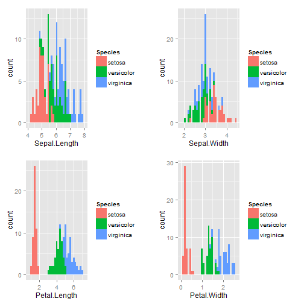
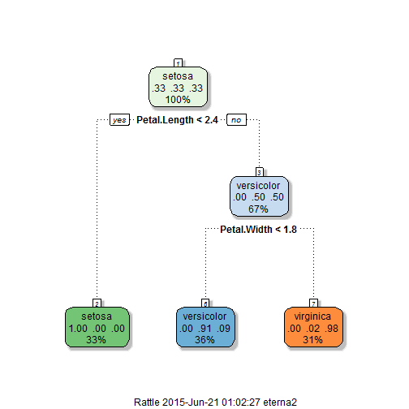

## Data set

This famous (Fisher's or Anderson's) iris data set gives the measurements in centimeters of the variables sepal length and width and petal length and width, respectively, for 50 flowers from each of 3 species of iris. The species are Iris setosa, versicolor, and virginica.

```
##   Sepal.Length Sepal.Width Petal.Length Petal.Width Species
## 1          5.1         3.5          1.4         0.2  setosa
## 2          4.9         3.0          1.4         0.2  setosa
## 3          4.7         3.2          1.3         0.2  setosa
## 4          4.6         3.1          1.5         0.2  setosa
## 5          5.0         3.6          1.4         0.2  setosa
```

--- .class #id 
## Data Exploration
This is a scatter plot showing the general distribution of the data.

<iframe src=chart1.html seamless></iframe>

--- 

## Data Exploration
This are the histogram showing the distribution by features with respect to the Species.
 

--- 
## Prediction Model'
This is the model to predict the species of the flower. As shown in the schema of the decision tree, Petal.Width and Petal.Length are the 2 primary predictors.


 


